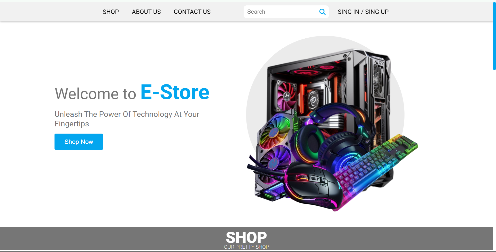
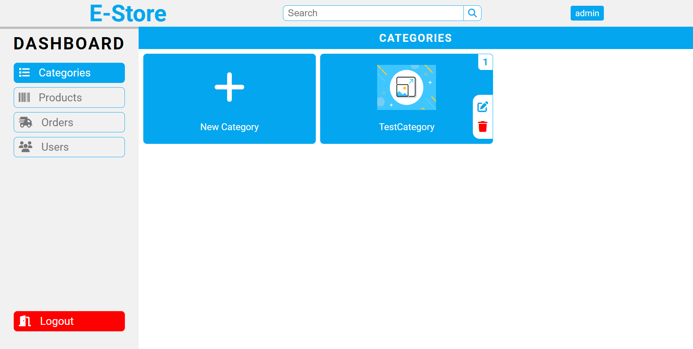
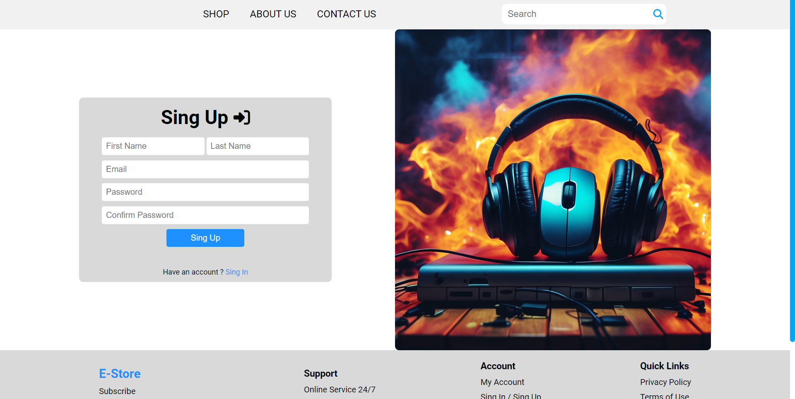
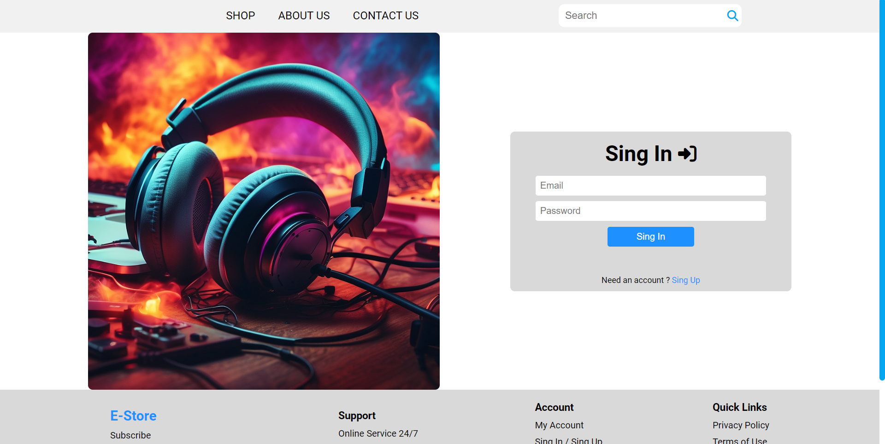

# E-Store

## Overview

E-Store is an e-commerce website for ALX Africa foundations curriculum that specializes in selling hardware, including PCs and laptops. This project was developed from scratch by a collaborative effort between frontend and backend developers.

## Features For

### Users

- **User-friendly Interface:** Enjoy a seamless and intuitive navigation experience.
- **Product Categories:** Easily browse through a variety of hardware products organized by categories.
- **Secure Authentication:** Ensure the security of your personal information with robust user authentication.
- **Shopping Cart Functionality:** Add products to your cart and manage your selections before making a purchase.
- **Checkout Process:** Streamlined and efficient checkout process for a hassle-free shopping experience.
- **Responsive Design:** Access E-Store on any device with a responsive design that adapts to different screen sizes.

### Admin

- **Product Management:** Easily add, update, or remove products from the inventory.
- **Order Management:** Monitor and manage customer orders efficiently.
- **User Management:** Administer user accounts, including authentication and authorization.
- **Category Management:** Organize products into categories for a well-structured inventory.
- **Security Controls:** Implement and manage security features to protect sensitive information.

## Technologies Used

### Frontend

- HTML5
- CSS3
- JavaScript

### Backend

- Backend language: Express.js Node.js
- Database used: MySQL

## Team Members

- Ahmed Walid - backend developer
- Abdelrahman Moussa - frontend developer
- Abdelmaguid Saif - frontend developer

## Live Demo
Check out the [live demo](https://Estore.com) to experience E-Store in action!

## Screenshots









## How to Run

1. Clone the repository:

   ```bash
   git clone https://github.com/abdulrahmn69/Estore.git
   ```

2. Navigate to the backend directory:

   ```bash
   cd Estore/backend
   ```
3. Create the database:
    ```bash
    mysql -u your_username -p < create-database.sql
    ```
4. Install dependencies:

    ```bash
    npm i
    ```

5. Run the server:

    ```bash
    npm start
    ```

6. Now you can start using the website locally:

    ```bash
    .\index.html
    ```

- Be sure that you have npm, MySQL installed or follow this links  
    https://nodejs.org/en/download  
    https://www.mysql.com/downloads/    

## Contribution Guidelines
If you'd like to contribute to E-Store, please follow these guidelines:

- Fork the repository.
- Create a new branch for your feature or bug fix.
- Make your changes and submit a pull request

## License
This project is licensed under the Creative Commons Attribution-ShareAlike 4.0 International License. See the LICENSE file for details